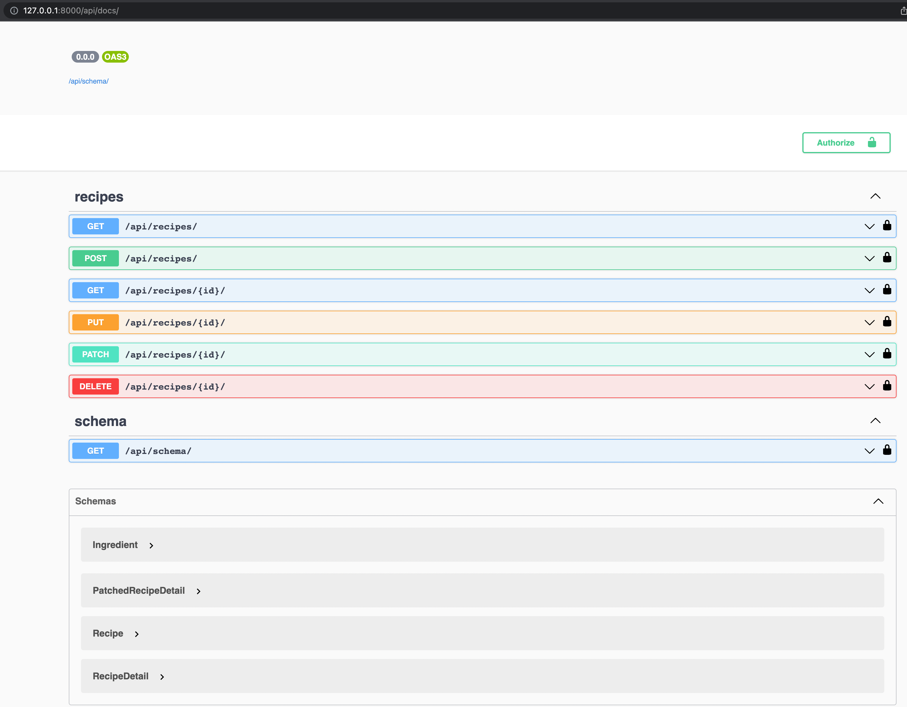

# Recipe API

- This repo implements the django exercise as outlined [here](https://www.notion.so/travelperk/Description-of-the-exercise-5db39976c0b34ff0a10ed5c84a6f7fe9).

# Running the app

- Run the following command:

    - `docker-compose up`

- Swagger docs can be accessed via the following url:

    - `http://127.0.0.1:8000/api/docs/`

# Running tests:

- Running the following command should run all the unit tests:

- `docker-compose run --rm app sh -c "python manage.py test"`

# Linting & Formatting:

- `docker-compose run --rm app sh -c "flake8"`    
- `docker-compose run --rm app sh -c "autopep8 --in-place --recursive"`